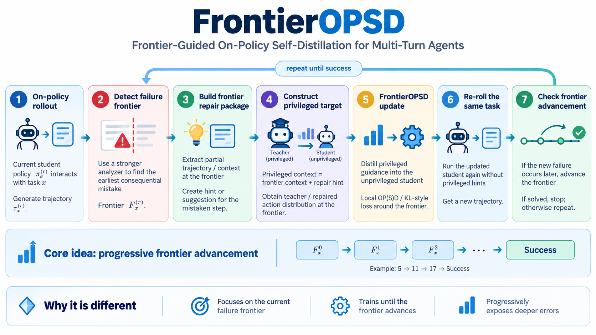

# FrontierOPSD

**Frontier-Guided On-Policy Self-Distillation for Multi-Turn Agents**

FrontierOPSD trains an agent at the earliest consequential mistake in its current trajectory. A stronger critic identifies the mistaken step and supplies a hint. A frozen current student re-scores the original step tokens with the hint; the trainable student learns without seeing it.

The implementation reuses [SDAR](https://github.com/ZJU-REAL/SDAR)'s ALFWorld, WebShop, and Search-QA datasets, prompts, task splits, and validation protocol.



## Method

Training proceeds in complete passes over the configured training tasks. Each task gets one fresh, unhinted rollout per epoch, using the student weights at the time its batch is visited.

1. Collect a fresh trajectory from the current student without hints. Record task success using the environment outcome.
2. Skip successful trajectories for training. For a failed trajectory, ask the separate stronger critic for the earliest consequential error index and a hint.
3. Keep the original mistaken-step response and pre-action context.
4. Before any update, score those same tokens with the frozen current student twice: with the hint for teacher scores, and without it for rollout-policy scores.
5. Minimize KL divergence between the student and the hint-conditioned self-teacher at the mistaken step. The student receives the original context without the hint.
6. Move to the next batch. Only after the full data pass, start the next epoch and generate fresh unhinted trajectories. Successful tasks skip training for this epoch and are still revisited next epoch.


## KL distillation objective

Each batch begins with fresh trajectories generated by the unhinted student with weights $\theta_{\mathrm{old}}$. For each diagnosed failure $i$, the critic identifies a mistaken step and provides a hint $h_i$. Let $c_i$ be the context before that step and $y_{i,<t}$ the preceding tokens of its original response. At token position $t$, define

$$
p_{\theta}^{i,t}(v) = \pi_{\theta}(v \mid c_i, y_{i,<t}), \qquad q^{i,t}(v) = \pi_{\theta_{\mathrm{old}}}(v \mid c_i, h_i, y_{i,<t}).
$$

where $v$ is a candidate token in the vocabulary $\mathcal{V}$. The trainable student uses the original context. The self-teacher uses the frozen pre-update student weights and the additional hint. Both condition on the same original response prefix; the stronger critic supplies the hint only.

We minimize the reverse KL divergence from the student to the self-teacher, giving each diagnosed step equal weight:

$$
\mathcal{L}_{\mathrm{KL}}(\theta) = \frac{1}{|\mathcal{B}|} \sum_{i \in \mathcal{B}} \frac{1}{|M_i|} \sum_{t \in M_i} D_{\mathrm{KL}}\left(p_{\theta}^{i,t} \parallel q^{i,t}\right).
$$

Here, $\mathcal{B}$ is the set of diagnosed failures in the current batch, and $M_i$ contains the valid token positions in example $i$'s original mistaken step. At each fixed prefix,

$$
D_{\mathrm{KL}}\left(p_{\theta}^{i,t} \parallel q^{i,t}\right) = \sum_{v \in \mathcal{V}} p_{\theta}^{i,t}(v) \log\frac{p_{\theta}^{i,t}(v)}{q^{i,t}(v)}.
$$

The implementation uses the existing sampled OPSD estimator on the original rollout tokens, with importance weighting relative to the cached unhinted rollout-policy scores. Teacher and rollout-policy scores remain fixed throughout the batch update. A batch with no diagnosed failures produces no distillation update.

## Installation and data preparation


### ALFWorld and Search training environment

The following package versions are inherited from SDAR's installation instructions:

```bash
conda create -n frontieropsd python=3.12 -y
conda activate frontieropsd
pip install vllm==0.11.0
pip install flash-attn==2.7.4.post1 --no-build-isolation --no-cache-dir
pip install -e .
```

For ALFWorld, install the environment and download its games:

```bash
pip install gymnasium==0.29.1 stable-baselines3==2.6.0 alfworld
alfworld-download -f
export ALFWORLD_DATA="$HOME/data/alfworld"
```

The ALFWorld and WebShop launch scripts generate SDAR's driver parquet files at `~/data/verl-agent/text/train.parquet` and `~/data/verl-agent/text/test.parquet`.

### WebShop environment

WebShop follows SDAR's separate Python 3.10 environment:

```bash
conda create -n frontieropsd-webshop python=3.10 -y
conda activate frontieropsd-webshop
(
    cd agent_system/environments/env_package/webshop/webshop
    bash setup.sh -d all
)
pip install torch==2.6.0 --index-url https://download.pytorch.org/whl/cu124
pip install flash-attn==2.7.4.post1 --no-build-isolation
pip install -e .
pip install vllm==0.8.2
```

## Run FrontierOPSD


### ALFWorld

```bash
CUDA_VISIBLE_DEVICES=0,1,2,3,4,5 \
bash examples/frontier_opsd/run_sdar_dataset.sh alfworld vllm \
    trainer.nnodes=1 \
    trainer.n_gpus_per_node=4 \
    +algorithm.frontier.critic_api=vllm \
    +algorithm.frontier.critic_model=Qwen/Qwen3-32B \
    +algorithm.frontier.critic_tensor_parallel_size=2 \
    +actor_rollout_ref.actor.frontier_micro_batch_size_per_gpu=1 \
    trainer.experiment_name=frontieropsd_alfworld_qwen2.5_3b \
    trainer.logger='[console]'
```

### WebShop

```bash
CUDA_VISIBLE_DEVICES=0,1,2,3,4,5 \
bash examples/frontier_opsd/run_sdar_dataset.sh webshop vllm \
    trainer.nnodes=1 \
    trainer.n_gpus_per_node=4 \
    +algorithm.frontier.critic_api=vllm \
    +algorithm.frontier.critic_model=Qwen/Qwen3-32B \
    +algorithm.frontier.critic_tensor_parallel_size=2 \
    +actor_rollout_ref.actor.frontier_micro_batch_size_per_gpu=1 \
    trainer.experiment_name=frontieropsd_webshop_qwen2.5_3b \
    trainer.logger='[console]'
```


## Acknowledgments

FrontierOPSD is adapted from [SDAR](https://github.com/ZJU-REAL/SDAR) and reuses infrastructure from [veRL](https://github.com/volcengine/verl) and [verl-agent](https://github.com/langfengQ/verl-agent), with environments from [ALFWorld](https://github.com/alfworld/alfworld), [WebShop](https://github.com/princeton-nlp/WebShop), and [Search-R1](https://github.com/PeterGriffinJin/Search-R1). The repository retains the upstream [Apache 2.0 license](LICENSE) and attribution.
